# SLL-PROP-DATA-001F — Canonical Database Design v0.1 (draft)

- Parent: `SLL-PROP-DATA-001` (frozen) · Boundary: `001A` (frozen) · Contracts realised: `001B` (frozen), `001C`/`001D`/`001E` (draft for freeze)
- Status: **Draft** (2026-09-17). Per ADR-0005 §2.4 the first *full* L2/L3 DDL waits for 001C–001E to freeze; this draft fixes the physical design now so freezes do not stall on schema work. `schema_extract.sql` and `schema_geo.sql` are applied today; `schema_market.sql` is **written, linted and validated; not applied by default** (absent from `db.L2_SCHEMA_PATHS`) — applied at startup only when `LENS_RESOLUTION_ENABLED=1` (`db.enable_market`), which is how the 001E wiring is exercised on disposable databases before the freeze.
- Sequencing: freeze 001C+001D (golden gates) → apply nothing new; freeze 001E (reviewed sample) → add `schema_market.sql` to `L2_SCHEMA_PATHS` → 001F v1.0 frozen.

## 1. Principles (physical consequences of 001A)

| Invariant | Physical rule |
|---|---|
| I1 evidence never deleted | L2/L3 never `DELETE`; L2 tables reference L1 by key **without FK** (L1 retention is policy-driven and independent); all history tables are append-only with `supersedes_*` |
| I2 claim ≠ fact | claims carry `extraction_method, method_version, confidence, review_status` NOT NULL (`extract.claims`); nothing downstream stores a bare value |
| I3 four identities | `records.key` (L1) · `extract.observations` · `resolution.listing_clusters` · `market.properties` (`MP-`) · BizProp+ `AST-` never appears |
| I4/I7 asking, time-series | `extract.price_observations` append-only; `market.property_stats_snapshots` only — `market.properties` has **no** price column (lint R6) |
| I5/I6 vocabulary, precision | `geo.resolved_locations.precision` NOT NULL with CHECK; no `parcel`/`title`/`owner` columns (lint R2) |
| I8 reversible, explainable | `resolution.entity_candidates` keep every signal; `entity_decisions` append-only with `supersedes_decision_id`; `property_transitions` audit; `market.properties.status` instead of DELETE |
| I9 only L3 crosses | `publish.*` is the only schema the Reference API reads; contacts never referenced from `publish.*` |
| I10 minimisation | contact raw values only as `extract.contact_points.raw_value_enc` (pgcrypto); `advertiser.advertisers` has no fields beyond role + existing display name |

## 2. Schemas and files

| Schema | File | Applied | Tables / views |
|---|---|---|---|
| `public` (L0/L1) | `schema.sql` | yes | `records`, `raw_captures`, `capture_events`, `seen_links`, `ingest_runs`, `raw_payloads` |
| `extract` (L2) | `schema_extract.sql` | yes | `runs`, `observations`, `claims`, `price_observations`, `fx_rates`, `contact_points`, `contact_sightings`, view `current_observations` |
| `geo` (L2 ref + L2) | `schema_geo.sql` | yes | `admin_versions`, `provinces`, `districts`, `villages`, `name_aliases`, `resolved_locations` |
| `resolution` (L2) | `schema_market.sql` | **draft** | `runs`, `listing_clusters`, `cluster_members`, `cluster_edges`, `entity_candidates`, `entity_decisions`, view `current_decisions`, `property_transitions` |
| `market` (L2) | `schema_market.sql` | **draft** | `properties`, `property_stats_snapshots` |
| `advertiser` (L2, restricted) | `schema_market.sql` | **draft** | `advertisers`, `author_links`, `advertiser_contacts` |
| `publish` (L3) | `schema_market.sql` | **draft** | `datasets`, `dataset_versions`, `version_members` |

Later additive migrations (separate files, same lint): PostGIS `geom` columns on `geo.*` and `resolved_locations` (G1); `records.protected` is already present (001B) and is set by the publish service.

## 3. ERD (logical → physical)

```mermaid
erDiagram
    records ||--o{ capture_events : "record_key"
    raw_captures ||--o{ capture_events : "payload_hash"
    records ||--o{ extract_observations : "record_key (no FK)"
    extract_runs ||--o{ extract_observations : run_id
    extract_observations ||--o{ extract_claims : observation_id
    extract_observations ||--o{ extract_price_observations : observation_id
    extract_claims ||--o{ extract_price_observations : claim_id
    extract_claims ||--o| extract_contact_sightings : claim_id
    extract_contact_points ||--o{ extract_contact_sightings : contact_hash
    extract_observations ||--o{ geo_resolved_locations : observation_id
    geo_admin_versions ||--o{ geo_villages : admin_version
    geo_admin_versions ||--o{ geo_resolved_locations : admin_version
    resolution_runs ||--o{ resolution_listing_clusters : run_id
    resolution_listing_clusters ||--o{ resolution_cluster_members : cluster_id
    resolution_listing_clusters ||--o{ resolution_cluster_edges : cluster_id
    extract_observations ||--o{ resolution_entity_candidates : observation_id
    market_properties ||--o{ resolution_entity_candidates : market_property_id
    extract_observations ||--o{ resolution_entity_decisions : observation_id
    market_properties ||--o{ resolution_entity_decisions : market_property_id
    resolution_entity_decisions ||--o| resolution_entity_decisions : supersedes_decision_id
    market_properties ||--o| market_properties : superseded_by
    market_properties ||--o{ market_property_stats_snapshots : market_property_id
    market_properties ||--o{ resolution_property_transitions : source_property_id
    advertiser_advertisers ||--o{ advertiser_author_links : advertiser_id
    advertiser_advertisers ||--o{ advertiser_advertiser_contacts : advertiser_id
    extract_contact_points ||--o{ advertiser_advertiser_contacts : contact_hash
    publish_datasets ||--o{ publish_dataset_versions : dataset_id
    publish_dataset_versions ||--o{ publish_version_members : "dataset_id, version"
    market_properties ||--o{ publish_version_members : market_property_id
    market_property_stats_snapshots ||--o{ publish_version_members : snapshot_id
```

## 4. Key design choices

| Topic | Choice | Why |
|---|---|---|
| Market property id | `MP-` + ULID (26 Crockford chars), CHECK-enforced | sortable, allocation without a sequence round-trip, never reused (E5) |
| "Current" rows | views (`extract.current_observations`, `resolution.current_decisions`) over append-only tables | no `is_current` flags to keep in sync; history stays queryable |
| Merge/split | `market.properties.status` + `superseded_by` (CHECK: SUPERSEDED ⇔ superseded_by set) + `property_transitions` audit; observations get **new** decisions | ids remain resolvable for BizProp+ references; every hop is a row |
| Statistics | `market.property_stats_snapshots` (JSONB per price type, `stats_version`, `computed_at`) | recomputed on every decision change; readers take the latest; nothing on `properties` (R6) |
| Clusters | deterministic `cluster_id = 'C-' + min(record_key)`; edges stored with rule + signals | re-runs reproduce ids; explainability at the edge level |
| Advertisers | `AD-` ULID; links from `author_hash` via `CONTACT_HASH` or `HUMAN`, superseded never edited | I10: no dossier, no enrichment |
| Contacts | only `extract.contact_points` holds a value (encrypted); `advertiser_contacts` and `contact_sightings` hold hashes | D5; `publish.*` cannot reach contacts even by join |
| Publication | `dataset_versions` immutable once `PUBLISHED` (application rule + checksum); `version_members` pin the snapshot id and observation ids included | L3 is a frozen view of L2 at publish time; provenance from any published number → snapshot → decisions → observations → claims → capture events → raw payload hash |
| Retention | publish step sets `records.protected = true` for members' L1 rows (D3); L2/L3 never purged | enforced in the purge SQL already merged (Phase 5) |

## 5. Lint rules in force (CI, `scripts/schema_lint.py`)

R1 no L0/L1 statements in L2/L3 files · R2 no bare `price/owner/property/area/parcel/title`, no
BizProp+ ids · R3 observation/claim tables: NOT NULL 0..1 confidence · R4 core file has no
DROP/DELETE/TRUNCATE or L2 objects · R5 claims JSON forbids `raw_value` · **R6** `market.properties`
has no price-like column · **R7** `*_snapshots` carry `stats_version` + `computed_at` · **R8**
`*decisions` / `*_links` carry `supersedes_*` and no `updated_at`.

## 6. Validation performed on this draft

Applied twice to a disposable PostgreSQL 16 (idempotent); probes: ULID CHECK rejects `MP-bad`;
`HUMAN` decision without reviewer rejected; `SUPERSEDED` without `superseded_by` rejected;
`current_decisions` returns only the surviving HUMAN row after a supersede chain; merge via
status keeps both ids. Lint: 0 violations across all four schema files.

## 7. Open items before v1.0

1. PostGIS columns and `ST_Within`/`ST_DWithin` indexes (G1) — separate additive file.
2. Row-level access for `advertiser.advertiser_contacts` / `extract.contact_points.raw_value_enc` (reviewer role — 001G).
3. `publish.version_members.observation_ids` may move to a child table if versions exceed ~10⁵ members.
4. Apply `schema_market.sql` (add to `L2_SCHEMA_PATHS`) when 001E freezes; bump lens-api minor.
